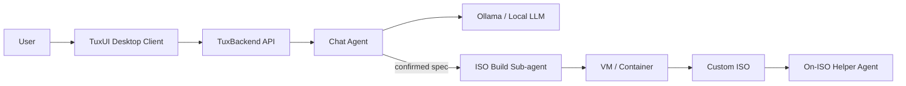

<div align="center">


# TuxTailor

[](LICENSE)
[](https://github.com/Omar-Mhd-Fadi-Zaraa/TuxTailor/stargazer)
[](https://github.com/Omar-Mhd-Fadi-Zaraa/TuxTailor/issues)
[](https://github.com/Omar-Mhd-Fadi-Zaraa/TuxTailor/pulls)
[](https://go.dev/)
[](https://www.python.org/)
[](https://svelte.dev/)

</div>

TuxTailor is an open-source, AI-powered platform for creating custom Linux ISO images tailored to a user's system requirements. A conversational agent guides users through choosing a distribution, packages, and configurations, then delegates ISO creation to a dedicated build sub-agent.

The project is aimed at organizations that want to migrate their machines to a unified, customized Linux environment—and can be fully self-hosted so teams run the entire stack on their own infrastructure.

## Features

- **Conversational ISO design** — Chat with an AI assistant to clarify use cases, compare distributions, and select packages and system settings.
- **Automated ISO builds** — A backend sub-agent downloads base images, provisions a VM or container, installs packages, applies configuration, and produces a bootable ISO.
- **On-ISO helper agents** — Each generated image can include a lightweight AI assistant that helps end users understand the custom configuration and installed packages.
- **Self-hostable** — Run the backend and model provider on your own servers; the desktop client can point at a local or remote backend.
- **Streaming chat UI** — Desktop app with a chat-first interface, confirmation prompts, and settings for backend URL, themes, and display preferences.

## How it works



1. The user describes their needs in the chat UI.
2. The **chat agent** reasons about requirements, researches distributions and packages, and proposes a configuration (with user confirmation).
3. The **build sub-agent** downloads the chosen base ISO, creates a VM or container, installs packages, applies configuration, and exports the final image.
4. The resulting ISO can ship with a **helper chatbot** pre-configured for that environment.

## Architecture

| Component | Role | Stack |
|-----------|------|-------|
| **TuxUI** | Desktop chat client | [Wails](https://wails.io/) (Go) + [Svelte](https://svelte.dev/) |
| **TuxBackend** | Public API, persistence, agent orchestration | [FastAPI](https://fastapi.tiangolo.com/) (Python) |
| **Agents** | Chat reasoning and ISO build automation | [LangChain](https://www.langchain.com/) + [Ollama](https://ollama.com/) |
| **Database** | Users, chats, and message history | SQLite |

The system uses a **multi-agent** design: a front-end chat agent handles user interaction and requirement gathering, while a separate backend agent focuses on shell commands, Packer configs, and ISO assembly.

## Project structure

```
TuxTailor/
├── Application/
│   ├── TuxUI/          # Wails desktop app (Go + Svelte frontend)
│   └── TuxBackend/     # FastAPI backend, agents, and database
│       ├── Agents/     # LangChain agents and tools
│       ├── app/        # FastAPI application entry point
│       ├── config/     # Environment and constants
│       ├── db/         # SQLite persistence
│       ├── models/     # Pydantic schemas
│       ├── routes/     # API routers
│       └── utils/      # Auth and shared utilities
├── LICENSE
└── README.md
```


## API overview

| Method | Endpoint | Description |
|--------|----------|-------------|
| `POST` | `/base/health` | Health check |
| `POST` | `/agent/invoke` | Stream agent responses (NDJSON) |
| `POST` | `/chat/message` | Send a user message *(planned)* |
| `POST` | `/chat/confirmation` | Submit user confirmation *(planned)* |
| `GET` | `/chat/message` | Receive AI response *(planned)* |
| `POST` | `/users/login` | User login *(planned)* |
| `POST` | `/users/preferences` | Save user preferences *(planned)* |
| `GET` | `/users/preferences` | Load user preferences *(planned)* |
| `GET` | `/files/isodownload` | Download the finished ISO *(planned)* |

## Roadmap

- [ ] Complete FastAPI ↔ agent streaming (SSE / NDJSON)
- [ ] Implement agent tools (web search, package lookup, Packer config generation)
- [ ] VM/container provisioning for ISO builds (Docker, Packer)
- [ ] ISO export pipeline
- [ ] On-ISO helper agent with per-system RAG
- [ ] Rich UI elements (media, inline confirmations, source viewing)
- [ ] Remote backend connection and authentication

## License

This project is licensed under the [MIT License](LICENSE).

---

#### Code references
- [Transok-wails](https://github.com/bent2685/transok-wails)
